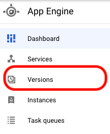
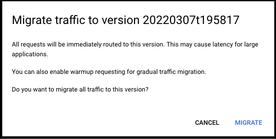

# Saturn prod deploy

Runs the Saturn production deploy process. This is done via scheduled workflow on CircleCI. See the `config.yml` file for details.

## Saturn Hotfix Procedure
1. Create a hotfix ticket on your board
2. Once your ticket is created open it and click "Add Checklist" (at the top of the edit modal)
3. In the checklist section select "load templates"

4. Choose the `Terra UI Hotfix Release Template`
5. Follow the instructions on this template

## Saturn Rollback Procedure

### Prequisites
You will need a `firecloud.org` account and your account will need to be in the `firecloud-project-owners` group.

You can check your access by trying to access the [bvdp-saturn-prod](https://console.cloud.google.com/appengine/versions?project=bvdp-saturn-prod&serviceId=default) project.

If you cannot access this project you will need to contact dsp-devops. You can request access to the project in the [dev ops channel](https://broadinstitute.slack.com/archives/CADM7MZ35)

### Procedure
1. Make an announcement on the [terra-ui](https://broadinstitute.slack.com/archives/C01EHNUM73R) channel that you will be rolling back the release
2. Make sure you are logged in to your `firecloud.org` account
3. Go to the [saturn prod deployment project](https://console.cloud.google.com/appengine/versions?project=bvdp-saturn-prod&serviceId=default) in the gcp console
4. Once in the console go to the App Engine Versions
  

4. Choose the version prior to the current running version. 

5. Once you have selected the version click "Migrate Traffic"
   1. A dialog box will pop up, click "Migrate" 
  

6. Confirm that the release has been rolled back and is working by visiting [Terra](https://app.terra.bio/) and checking the build date of the application by scrolling to the bottom of the hamburger menu:

7. Make an announcement on the [terra-ui](https://broadinstitute.slack.com/archives/C01EHNUM73R) channel that you have completed the rollback.
 